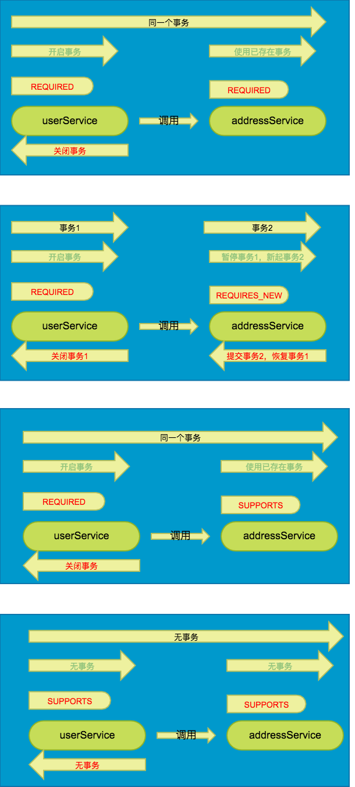

# Spring声明式事务

Spring提供了编程式事务和声明式事务两种机制。为便于理解，简单回顾下JDBC和Hibernate的事务管理方式。

* JDBC方式：

  ```java
  Connection conn = DataSourceUtils.getConnection();
  //开启事务
  conn.setAutoCommit(false);
  try {
    Object retVal = 
        callback.doInConnection(conn);
    conn.commit(); //提交事务
    return retVal;
  }catch (Exception e) {
    conn.rollback();//回滚事务
    throw e;
  }finally {
    conn.close();
  }
  ```

* Hibernate方式：

  ```java
  Session session = null;
  Transaction transaction = null;
  try {
    session = factory.openSession();
    //开启事务
    transaction = session.beginTransaction();
    transation.begin();
    session.save(user);
    transaction.commit();//提交事务
  } catch (Exception e) {
    transaction.rollback();//回滚事务
    return false;
  }finally{
    session.close();
  }
  ```


看下Spring编程式方式：

```java
        //1.获取事务管理器
        PlatformTransactionManager txManager =ctx.getBean("txManager");        
        //2.定义事务属性
        DefaultTransactionDefinition td = new DefaultTransactionDefinition();
        td.setIsolationLevel(TransactionDefinition.ISOLATION_READ_COMMITTED);
        //3开启事务,得到事务状态
        TransactionStatus status = txManager.getTransaction(td);
        try {
            //4.执行数据库操作
            jdbcTempate.queryForInt("select count(*) from tbl_doc");
            //5、提交事务
            txManager.commit(status);

        }catch (Exception e) {
            //6、回滚事务
            txManager.rollback(status);
        }
```

可以看到，以上几种方式都比较复杂，需要我们自己处理事务，要做的事情比较多。而Spring的声明式事务使用简单，它支持注解和xml配置，这里以注解为例。

## @Transactional

Spring声明式事务的使用，一切都落在注解**@Transactional**上。

先看一个简单的例子，在实现类的加注解，实现事务控制。

```java
<!-- the service class that we want to make transactional -->
@Transactional 
public class DefaultFooService implements FooService { 
       Foo getFoo(String fooName); 
       Foo getFoo(String fooName, String barName); 
       void insertFoo(Foo foo); 
       void updateFoo(Foo foo); 
} 
```

#### 使用方法

* @Transactional可用于接口、接口方法、实现类以及类方法上。放在接口或类上，相当于为此接口或类下所有的public方法都加了这样一个注解。
* Spring团队的建议是你在具体的类（或类的方法）上使用 @Transactional 注解，而不要使用在类所要实现的任何接口上。你当然可以在接口上使用 @Transactional注解，但是这将只能当你设置了基于接口的代理时它才生效。因为注解是不能继承的，这就意味着如果你正在使用基于类的代理时，那么事务的设置将不能被基于类的代理所识别，而且对象也将不会被事务代理所包装（将被确认为严重的）。因此，请接受Spring团队的建议并且在具体的类上使用@Transactional注解。
* **@Transactional注解应该只被应用到public的方法上。** 如果你在 protected、private 或者 package-visible 的方法上使用，它也不会报错，也不会生效。
* 方法的@Transactional会覆盖类上面声明的事务，也就是方法上的优先级高。

### @Transactional属性

@Transactional有以下几个属性可以设置。

| 属性 | 类型 | 描述 |
| :--- | :--- | :--- |
| value | String | Optional qualifier specifying the transaction manager to be used. |
| propagation | enum: Propagation | Optional propagation setting. |
| isolation | enum: Isolation | Optional isolation level. |
| readOnly | boolean | Read\/write vs. read-only transaction |
| timeout | int \(in seconds granularity\) | Transaction timeout. |
| rollbackFor | Array of Class objects, which must be derived from Throwable. | RuntimeException | Optional array of exception classes that must cause rollback. |
| rollbackForClassName | Array of class names. Classes must be derived from Throwable. | Optional array of names of exception classes that must cause rollback. |
| noRollbackFor | Array of Class objects, which must be derived from Throwable. | Optional array of exception classes that must not cause rollback. |
| noRollbackForClassName | Array of String class names, which must be derived from Throwable. | Optional array of names of exception classes that must not cause rollback. |

注意@Transactional的默认值，传播行为是Required，隔离级别是Default（Oracle和SqlServer是读已提交，MySql是可重复读），**尤其注意rollbackFor，在抛出RuntimeException时才回滚**，意思是，不抛出异常不回滚，抛出异常不是RuntimeException（及其子类）也不回滚，再进一步说，有异常就让它抛出来，不要主动catch消化掉。

#### 隔离级别

请参考数据库事务介绍章节。特别注意一个问题，Oracle不支持可重复读，如果在注解里设置为可重复读，会有什么结果。 H2也不支持可重复读，设置为可重复读没有报异常，能正常执行，但是生效的隔离级别为读已提交。

#### 传播行为（Propagation）

所谓事务传播行为就是多个事务方法相互调用时，事务如何在这些方法间传播。Spring 支持 7 种事务传播行为：

* **PROPAGATION\_REQUIRED** 如果当前没有事务，就新建一个事务，如果已经存在一个事务中，加入到这个事务中。这是最常见的选择。
* **PROPAGATION\_SUPPORTS** 支持当前事务，如果当前没有事务，就以非事务方式执行。
* **PROPAGATION\_MANDATORY** 使用当前的事务，如果当前没有事务，就抛出异常。
* **PROPAGATION\_REQUIRES\_NEW** 新建事务，如果当前存在事务，把当前事务挂起。
* **PROPAGATION\_NOT\_SUPPORTED** 以非事务方式执行操作，如果当前存在事务，就把当前事务挂起。
* **PROPAGATION\_NEVER** 以非事务方式执行，如果当前存在事务，则抛出异常。
* **PROPAGATION\_NESTED** 如果当前存在事务，则在嵌套事务内执行。如果当前没有事务，则开启一个新的事务。PROPAGATION\_NESTED 开始一个 "嵌套的" 事务,  它是已经存在事务的一个真正的子事务. 潜套事务开始执行时,  它将取得一个 savepoint. 如果这个嵌套事务失败, 我们将回滚到此 savepoint. 潜套事务是外部事务的一部分, 只有外部事务结束后它才会被提交. 嵌套事务回滚不影响外部事务，但外部事务回滚将导致嵌套事务回滚。 使用嵌套事务需要JDBC3.0并且事务管理器开启嵌套事务（常用的JpaTransactionManager和HibernateTransactionManager默认是不开启的），如果没有开启，运行时将抛出异常。

举例，现有用户和地址管理，假如每增加一个新用户就需要自动增加一个与此用户相关的地址（这例子真挫，至今没有见到过这样的需求）。那么代码大致是这个样子：

```java
//用户管理类
public class UserService {

    @Resource
    private UserDao userDao;

    /** 地址管理类 */
    @Resource
    private AddressService addressService;

    @Transactional
    public void save(User user){
        //执行sql保存用户信息
        userDao.add(user);

        Address address=new Address();//设置地址信息

        //执行sql保存地址信息
        addressService.save(address);
    }
}

//测试类
public class ApplicationTest {
    @Resource
    private UserService userService;

    @Test
    public void transactionalTest() {
        User user = new User();
        user.setUsername("Test-001");
        userService.save(user);
    }
}
```

@Transactional注解加在UserService.save和AddressService.save两个方法上，看下不同的传播形式。


具体的事务开启和关闭流程，设置spring的日志级别为debug后，运行，可看到类似于这面这样的日志。这里使用了Spring data jpa，打印的是JpaTransactionManager的日志。UserServices使用的传播行为是REQUIRED，AddressService使用REQUIRES\_NEW。

```
 - Creating new transaction with name [UserService.save]:PROPAGATION_REQUIRED,ISOLATION_DEFAULT; ''
 - Opened new EntityManager [org.hibernate.jpa.internal.EntityManagerImpl@16602333] for JPA transaction
 - Exposing JPA transaction as JDBC transaction [org.springframework.orm.jpa.vendor.HibernateJpaDialect$HibernateConnectionHandle@2dd4a7a9]
 - Found thread-bound EntityManager [org.hibernate.jpa.internal.EntityManagerImpl@16602333] for JPA transaction
 - Participating in existing transaction
 - Found thread-bound EntityManager [org.hibernate.jpa.internal.EntityManagerImpl@16602333] for JPA transaction
 - Suspending current transaction, creating new transaction with name [AddressService.save]
 - Opened new EntityManager [org.hibernate.jpa.internal.EntityManagerImpl@28b7646] for JPA transaction
 - Exposing JPA transaction as JDBC transaction [org.springframework.orm.jpa.vendor.HibernateJpaDialect$HibernateConnectionHandle@40239b34]
 - Found thread-bound EntityManager [org.hibernate.jpa.internal.EntityManagerImpl@28b7646] for JPA transaction
 - Participating in existing transaction
 - Initiating transaction commit
 - Committing JPA transaction on EntityManager [org.hibernate.jpa.internal.EntityManagerImpl@28b7646]
 - Closing JPA EntityManager [org.hibernate.jpa.internal.EntityManagerImpl@28b7646] after transaction
 - Closing JPA EntityManager
 - Resuming suspended transaction after completion of inner transaction
 - Initiating transaction commit
 - Committing JPA transaction on EntityManager [org.hibernate.jpa.internal.EntityManagerImpl@16602333]
 - Closing JPA EntityManager [org.hibernate.jpa.internal.EntityManagerImpl@16602333] after transaction
```

##### 额外待补充

几个概念：嵌套事务，事务保存点，事务挂起。

#### 只读事务

从事务开始到结束，看不到其他事务所提交的内容，也就避免了幻读和不可重复读。将事务设置为只读后，也就不能进行修改操作，数据库可能提供一些优化手段。当事务被标识为只读事务时，Spring可以对某些可以针对只读事务进行优化的资源就可以执行相应的优化措施，比如告之hibernate的session在只读事务模式下不用尝试检测和同步持久对象的状态的更新。

## 启用事务配置

仅仅使用@Transactional注解并不会启用事务，它只是一种元数据。具体如何配置不在这里罗列了，请参考互联网资源。这里提出来仅仅是为了提醒下，要确认注解是否生效。现在有了Spring boot后，很多配置都省略了，可以直接用了。

